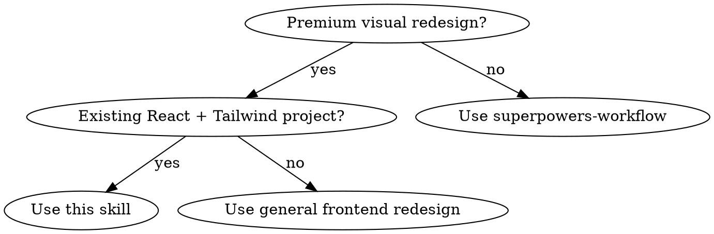

# React Premium Landing Effects

Add polished, dark-theme "wow" effects to a React/Next.js landing page without breaking type safety, accessibility, or the build.

## When to use

- User requests "premium redesign", "wow effects", "glassmorphism", "animated gradients", "shimmer", "floating particles", "counters", "staggered animations" on a landing page.
- The project is **Next.js 15 App Router + React 19 + TypeScript strict + Tailwind CSS v3** or a **Vite + React 19 SPA + TypeScript strict + Tailwind CSS v3** project.
- The existing site is already semantic and mobile responsive; the goal is to elevate the visual layer.

### SPA vs App Router differences

| Concern | Next.js App Router | Vite/React SPA |
|---|---|---|
| `"use client"` | Required on any interactive component | Not required (entire app is client-rendered) |
| SSR hydration | Must avoid `Math.random()` during render | Less strict, but still avoid random layout shift |
| Fonts | Use `next/font/google` or local self-host | Use CSS `@import` or local `/public/fonts/` |
| Build output | Static pages via `output: 'export'` or Node server | Static `dist/` via `vite build` |
| Video paths | Put under `/public/` | Put under `/public/` and reference with absolute `/` |

## Core principle

**Layer motion on top of stable structure.** Keep existing data types, semantic tags, heading hierarchy, and responsive layout. Use `framer-motion` for entrance/interaction animations and custom CSS keyframes for ambient, looped effects. Run `tsc --noEmit && npm run build` after every file.

## Decision tree



## Pattern library

### 1. Hero — animated gradient mesh + particles + glass card

- **Gradient mesh:** CSS `radial-gradient` layers on a pseudo-background element; animate with `background-position` via a `@keyframes mesh-move`. Use `aria-hidden="true"`.
- **Particles:** generate a static array of dots once (inside `useEffect` to avoid SSR mismatch), then animate each with `framer-motion` `animate` loops. Keep count ≤ 40 for performance.
- **Glass card:** `backdrop-filter: blur(20px)`, semi-transparent dark background, subtle white border. Tailwind utilities `backdrop-blur` plus a custom `.glass` class when the design needs stronger blur.
- **Headline entrance:** split headline into per-character `<motion.span>` elements with a staggered `delay` based on `lineIndex * line.length + charIndex`. Keep exactly one `<h1>`.
- **CTA shimmer:** apply an absolutely-positioned pseudo-element with a translate-X shimmer keyframe; keep it decorative and pointer-events none.

### 2. ProductCard — hover lift + gradient border + inner glow + image zoom

- Use `motion.article` with `whileHover={{ y: -8 }}` and `whileInView` fade-up.
- **Gradient border on hover:** a decorative `div` using `background: linear-gradient(...)` with `-webkit-mask` trick to show only the 1px border; opacity 0 → 1 on group hover.
- **Inner glow:** another decorative `div` with a top-centered radial gradient.
- **Image zoom:** Tailwind `group-hover:scale-110` with `transition-transform duration-500`.
- **Gradient feature tags:** `bg-gradient-to-r` plus a translucent border.

### 3. Stats — animated counting + gradient numbers

- Parse numeric portion of `value` (e.g. `20+` → `20`, suffix `+`).
- Use `requestAnimationFrame` with an ease-out curve inside a component wrapped by `useInView(..., { once: true })` so counting starts only when visible.
- Display numbers with a `.text-gradient` utility: `bg-clip-text text-transparent` plus a linear gradient.
- Use explicit divider lines via `border-r`/`border-b` rather than Tailwind `divide-*` for more control over gradients.

### 4. Contact — glass form card + gradient button + focus rings

- Wrap the form in a `.glass-strong` card with a decorative blurred orb behind it.
- Convert contact info into icon+content cards that lift on hover.
- Card wrapper: `rounded-2xl border border-stroke bg-surface/80 p-5 backdrop-blur-md sm:p-7`.
- Contact info cards: `rounded-xl border border-stroke bg-surface/80 p-4 backdrop-blur-md transition-colors hover:border-accent/30`.

### 5. Footer — top gradient border

Replace `border-t` with a 1px `div` using `linear-gradient(90deg, transparent, accent, cyan, violet, transparent)`.

## CSS/animation utilities to add to `globals.css`

Add CSS variables for glow colors and reusable keyframes:

```css
:root {
  --glow-accent: rgba(91, 140, 190, 0.55);
  --glow-accent-soft: rgba(91, 140, 190, 0.22);
  --glow-cyan: rgba(66, 220, 219, 0.35);
  --glow-violet: rgba(139, 92, 246, 0.32);
}

@keyframes gradient-shift { ... }
@keyframes float { ... }
@keyframes float-slow { ... }
@keyframes shimmer { ... }
@keyframes pulse-glow { ... }
@keyframes mesh-move { ... }
```

Utility classes:

```css
.text-gradient {
  @apply bg-clip-text text-transparent;
  background-image: linear-gradient(135deg, #5B8CBE, #7AA3D0, #42DCDB);
}
.glass { ... }
.glass-strong { ... }
```

## Constraints that must survive the redesign

- Keep existing types from `src/lib/data.ts` unchanged.
- Keep exactly one `<h1>` in Hero.
- Keep semantic tags (`<main>`, `<section>`, `<article>`, `<header>`, `<footer>`, `<nav>`).
- Mobile responsive: the same grid breakpoints must still collapse to one column on small screens.
- No `any`: all helper functions (particle generator, count-up) must be typed.
- Mark any component that uses `useEffect`, `useState`, `useRef`, event handlers, or `framer-motion` hooks as `"use client"`.

## Verification checklist

- [ ] `npx tsc --noEmit` passes with zero errors.
- [ ] `npm run build` passes and static pages are generated.
- [ ] Exactly one `<h1>` remains in the rendered HTML.
- [ ] Semantic tags still wrap content correctly.
- [ ] Mobile layout is single-column and readable.
- [ ] Animations respect `prefers-reduced-motion` where feasible (optional but recommended).
- [ ] No new `any` types introduced.
- [ ] No `JSX.Element` used under React 19; use `React.JSX.Element` or inference.
- [ ] Sections using `whileInView` do not start at `opacity: 0`; content must be visible on first paint.

## Common pitfalls

- **Video backgrounds can play but remain invisible.** A `<video>` element may report `paused=false` and a growing `currentTime`, yet be visually imperceptible behind dark gradient overlays, at very low opacity (e.g. `opacity-10`/`opacity-[0.12]`), or because the parent section lacks a stacking context and the negative-z video renders behind the section background. Always verify video visibility with a screenshot comparison, not just media-state checks. See `references/video-background-stacking-context.md` for the exact fix (`relative isolate` on the section, `relative z-10` on content, and correct opacity/overlays). On dark landing pages, start with `opacity-[0.20]`–`0.30` and reduce overlay density; adjust downward only if the screenshot shows it is too dominant.
- **Color changes must be visibly different.** When a user asks to change a color, a token swap that is mathematically different but imperceptible in context (e.g. one shade of blue to another behind an overlay) is not a real change. Pick a value with clear contrast against the background and adjacent elements, and verify the difference in a screenshot.
- **SSR mismatch on particles:** generating random values during render causes hydration mismatch in Next.js. Generate inside `useEffect`.
- **Inline style objects on motion components:** `style={{ left: `${x}%` }}` is fine for dynamic positions, but hoisted style constants should live outside the component.
- **Too many particles or `requestAnimationFrame` loops:** keep particles under 40 and stop count-up timers when not in view.
- **Client Component boundary errors:** any component with `onClick`, `useState`, `useEffect`, or `framer-motion` hooks needs `"use client"`.
- **Tailwind `gradient-border` utility conflicts:** the `-webkit-mask` border trick requires `border-radius: inherit` and `pointer-events-none`.
- **Framer Motion `initial={{ opacity: 0 }}` with `whileInView` on statically generated pages.** The SSR/SSG output is invisible until the client intersection observer fires, so first paint and screenshots look broken. Use `initial={{ opacity: 1, y: 20 }}` and animate only the transform. See `superpowers-workflow` → `references/framer-motion-ssr-initial-opacity.md`.
- **Full-width video backgrounds on mobile.** A looping video with a dark overlay can hide card grids on narrow viewports. Hide the video on mobile or reduce overlay opacity, and always verify mobile screenshots. See `superpowers-workflow` → `references/mobile-video-background-pitfall.md`.

## References

- `references/lane-b-hero-video-products-contact.md` — exact classes and verification output for adding a Hero background video, equal-height product cards, and glass Contact/OrderForm polish in a Vite React SPA.
- `references/vite-react-spa-landing-polish.md` — Vite + React 19 SPA landing-page polish workflow (baseline screenshots, equal-height cards, shared badges, glassmorphism).
- `references/product-card-badge-styles.md` — compact technical metadata badges for product cards and modals (dark surface, dot indicator, shared component).
- `references/local-landing-verification.md` — verifying local Vite/Next.js landing pages with Playwright because Hermes `browser_navigate` blocks `localhost`/`127.0.0.1`.
- `references/silicone-lending-v3-effects.md` — exact files, code patterns, and verification output from the session that shaped this skill.
- `references/silicone-lending-v3-wow-round2.md` — follow-up session: SSR opacity fix, card contrast improvements, section dividers, and OpenCode vs subagent notes.
- `superpowers-workflow` → `references/mobile-video-background-pitfall.md` — full-width video backgrounds can hide card grids on mobile.
- `superpowers-workflow` → `references/vite-preview-network-host.md` — exposing Vite preview server to LAN for cross-device review.

## Related skills

- `superpowers-workflow` — umbrella for the full build lifecycle.
- `frontend-efficiency-audit` — review the motion stack for leaks and re-renders.
- `frontend-css-maintenance` — safely refactor large `globals.css` changes.
- `code-quality-gates` — run the build/type gates.
