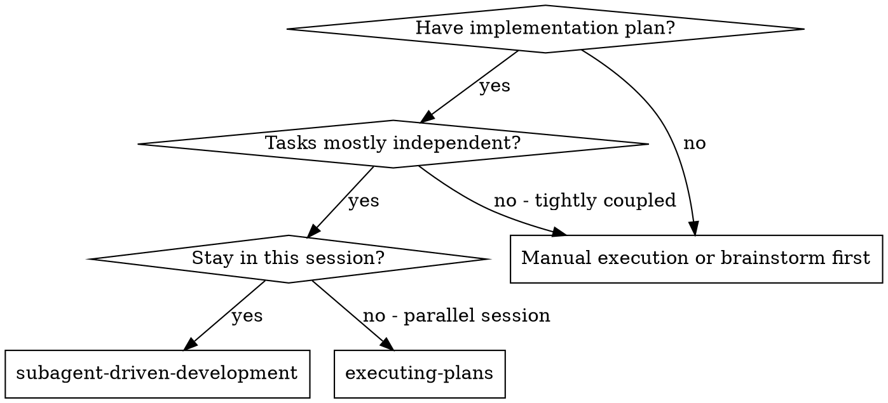
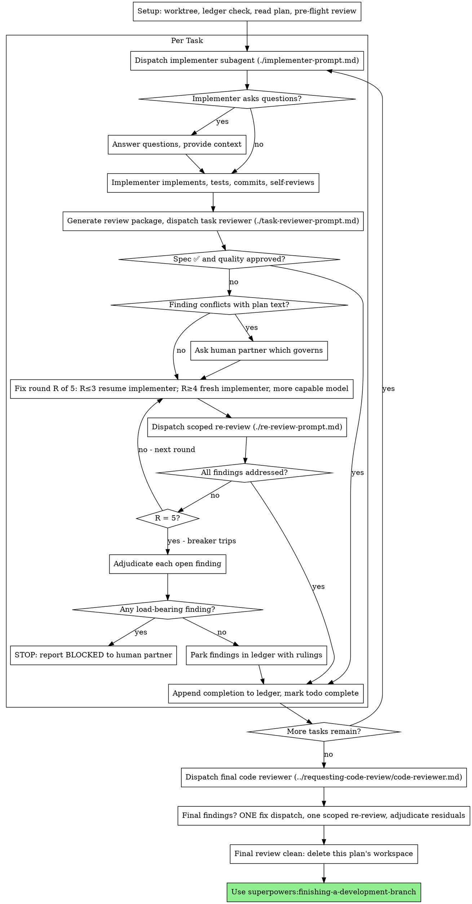

# OpenCode-Driven Development

Execute plan by running a fresh OpenCode agent per task, a task review (spec compliance + code quality) after each, and a broad whole-branch review at the end.

**Why OpenCode agents:** OpenCode runs in isolated sessions with full project context, git diff awareness, and optional MCP access. It is our preferred execution engine for multi-file/multi-task work. Hermes `delegate_task` subagents are reserved only for browser/profile research.

**Core principle:** Fresh OpenCode agent per task + task review (spec + quality) + broad final review = high quality, fast iteration

**Prerequisites (must be done first):**
1. The project directory must be a git repository. If it is not, run `git init && git add . && git commit -m "initial: baseline"` before any OpenCode task.
2. Start an OpenCode server in the project directory: `opencode serve --port 4096 --hostname 127.0.0.1`.
3. Execute with: `opencode run --auto --attach http://127.0.0.1:4096 --dir <project> --title '<task>' < brief.md`.
4. Capture output to a log file for review.

**Narration:** between tool calls, narrate at most one short line — the
ledger and the tool results carry the record.

**Continuous execution:** Do not pause to check in with your human partner between tasks. Execute all tasks from the plan without stopping. The only reasons to stop are: BLOCKED status you cannot resolve, ambiguity that genuinely prevents progress, or all tasks complete.

## When to Use



**vs. Executing Plans (parallel session):**
- Same session (no context switch)
- Fresh subagent per task (no context pollution)
- Review after each task (spec compliance + code quality), broad review at the end
- Faster iteration (no human-in-loop between tasks)

## The Process



## Setup

Ensure the work happens in a known, stable git workspace.

1. **Git is required.** If the project directory is not a git repository, initialize it before any OpenCode task:
   ```bash
   cd <project-root>
   if [ ! -d .git ]; then
     git init
     git add .
     git commit -m "initial: baseline"
   fi
   ```
   Never re-initialize an existing repository.
2. **Start the OpenCode server** in the project directory:
   ```bash
   cd <project-root>
   opencode serve --port 4096 --hostname 127.0.0.1
   ```
3. **Resolve workspace / ledger.** Each plan owns a workspace in `.superpowers/sdd/<plan-basename>/`. Run this skill's `scripts/sdd-workspace PLAN_FILE` to get the path. Check `<workspace>/progress.md` for prior state. If its first line names your plan file, resume at the first task without a `complete` line. If it names a different plan, start a fresh ledger.
4. **Create the ledger:** first line must be `# SDD ledger — plan: <plan file path>`.
5. **Read the plan once,** note Global Constraints, create todos per task, and scan for contradictions before dispatching Task 1.

If git exists, `git clean -fdx` will destroy the workspace (it's git-ignored scratch); recover from `git log` if needed. For non-git projects (which should be initialized now), preserve the workspace until the finish phase.

## Model Selection

For OpenCode execution, use the model configured in `~/.config/opencode/opencode.json` (default: `ollama/kimi-k2.7-code:cloud`). For reviewers, use the most capable model available in the same OpenCode server. The model is selected via `-m/--model` on `opencode run --attach` if you need to override for a specific task.

Turn count beats token price. For complex or judgment-heavy tasks, prefer a mid-to-capable tier even if it costs more per token. Mechanical single-file transcription can use the default model.

## The Task Loop

Everything the OpenCode agent prints back stays resident in your context for the rest of the session. Hand artifacts over as files, and capture OpenCode stdout to a log file.

### 1. Run the implementer

Record BASE (`git rev-parse HEAD`) before running.

- **Task brief:** before each task, run this skill's `scripts/task-brief PLAN_FILE N` to extract the task text to a unique file. Write an OpenCode brief that:
  1. Starts with `Do not use todo or planning tools.`
  2. Names the task and its place in the project.
  3. Includes an **External context sources** block ordering the agent to read `~/obsidian-memory/Operations/Coding Principles.md` via the obsidian MCP server and follow all principles there.
  4. References the extracted task brief as the single source of requirements.
  5. Carries interfaces and decisions from earlier tasks.
  6. Includes a visual verification contract for UI changes.
  7. Names the report-file path and log-file path.
- **Report file:** name it after the brief (`task-N-brief.md` → `task-N-report.md`). The OpenCode agent writes its full report there and returns only status, commits, a one-line test summary, and concerns.
- **Log file:** capture `opencode run` stdout/stderr to a log file in the workspace for post-run review.
- Run one task at a time to avoid file conflicts.
- Execute:
  ```bash
  opencode run --auto --attach http://127.0.0.1:4096 \
    --dir <project-root> \
    --title 'Task N: <title>' \
    < workspace/task-N-brief.md > workspace/task-N.log 2>&1
  ```
- Check the log for `DONE`, `DONE_WITH_CONCERNS`, `NEEDS_CONTEXT`, or `BLOCKED`.

### 2. Handle the report

OpenCode agents report one of four statuses in the report file:

**DONE:** Generate the review package (`scripts/review-package PLAN_FILE BASE HEAD`) and dispatch the task reviewer with the printed path.

**DONE_WITH_CONCERNS:** Read the concerns. If they are about correctness or scope, resolve before review. If observations only, proceed to review.

**NEEDS_CONTEXT:** Provide the missing context and re-run the same brief.

**BLOCKED:** Assess:
1. Context problem → re-run with more context.
2. Needs more reasoning → re-run with a more capable model.
3. Task too large → break into smaller tasks.
4. Plan itself is wrong → escalate to the human.

**Never** ignore a BLOCKED status.

### 3. Review the task

- Hand the reviewer its diff as a file via `scripts/review-package PLAN_FILE BASE HEAD`. Use the BASE recorded before running the implementer — never `HEAD~1`, which silently truncates multi-commit tasks.
- The reviewer is another OpenCode run (or a Hermes subagent if the review is browser/profile research only).
- The task reviewer verdicts both spec compliance AND code quality. Never accept a report missing either.
- Do not pre-judge findings for the reviewer.

### 4. The fix loop

Same as the original SDD loop, but fixes are executed via OpenCode runs, not `delegate_task`.

- Rounds 1–3: re-run the same brief with open findings appended.
- Rounds 4–5: escalate to a more capable model, framing: "A prior OpenCode run attempted this task [N] times; you own it now. Read the report file for what was tried."
- Every round ends with a scoped re-review.
- After five rounds, adjudicate and park or stop.

### 5. Complete the task

Append to the ledger:
- `Task <N>: complete (commits <base7>..<head7>, review clean)`
- `Task <N>: complete (commits <base7>..<head7>, <K> parked)` after a tripped breaker

## Final Review

Run `scripts/review-package PLAN_FILE MERGE_BASE HEAD` and dispatch the final reviewer. If findings exist, dispatch ONE OpenCode fix run with the complete findings list, then one scoped re-review. Residual load-bearing findings surface to the human partner during finishing.

## Finish

Use `superpowers:finishing-a-development-branch`. For git projects, delete the plan workspace (`rm -rf <workspace>`) once the branch is merged.

## Common Rationalizations

| Excuse | Reality |
|--------|---------|
| "Close enough on spec compliance" | Reviewer found spec gaps = not done. Fix or hit the cap and adjudicate. |
| "I'll fix it myself, dispatching is overhead" | Controller fixes pollute your context and skip review. Re-run OpenCode. |
| "One more round will converge" | Past the cap, the failure is structural. Adjudicate and route. |
| "The reviewer will just find something new anyway" | Scoped re-reviews verify fixes only. New findings go to the ledger. |
| "This finding is obviously wrong" | Adjudicate only at the cap, with a ledger entry. Silent discards are forbidden. |
| "The fix was small, skip the re-review" | Every round ends with a scoped re-review. |
| "Reviews slow the loop down" | Reviews are the loop's brakes and steering. |
| "Ledger bookkeeping is overhead" | The ledger survives compaction. |

## Pre-Flight Gate: Explicit Plan Approval

OpenCode-driven execution begins only after the human partner explicitly approves the written plan. Never run OpenCode against a vague verbal request.

## Parallel Lane Dispatch

Multiple OpenCode runs can happen concurrently **only when file sets are strictly disjoint**. Start one server; dispatch multiple `--attach` runs. After lanes finish, reconcile: re-read shared files, run full verification, capture after-screenshots.

## Localhost / Internal-Address Verification

Hermes `browser_navigate` blocks private/internal URLs. Use Playwright directly from the project directory. Capture at least desktop, mobile, and modal states.
